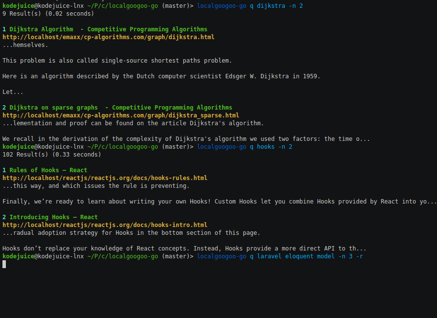

<h1 align="center"></h1>

<p align="center">
<a href="https://github.com/kodejuice/localgoogoo-go/blob/master/LICENSE"></a>
<a href="https://github.com/kodejuice/localgoogoo-go/actions"></a>
</p>

<p align="center">
<a href="https://asciinema.org/a/395033">

</a>
</p>

A command line tool that lets you use localGoogoo from the terminal (written in Go).

Don't know what localGoogoo is?, you should <a href="https://github.com/kodejuice/localgoogoo-go"> check it out </a>


## Installation

### Requirements
  * Golang
  * <a href="https://github.com/kodejuice/localgoogoo">localGoogoo</a> installed on your system
<br><br>

#### Install using `go get`

```bash
$ go get http://github.com/kodejuice/localgoogoo-go
```

#### Install using `git clone`

```bash
$ git clone http://github.com/kodejuice/localgoogoo-go.git
$ cd localgoogoo-go
$ go install
```

This installs `localgoogoo-go` to your local machine, you can alias it to a shorter name, such as `localgoogoo` or `googoo`

Usage
-------------

Make sure localGoogoo is functioning properly in the browser, because all this package does is make http requests to localgoogoo installed on your system and render the results of any query on your terminal.


