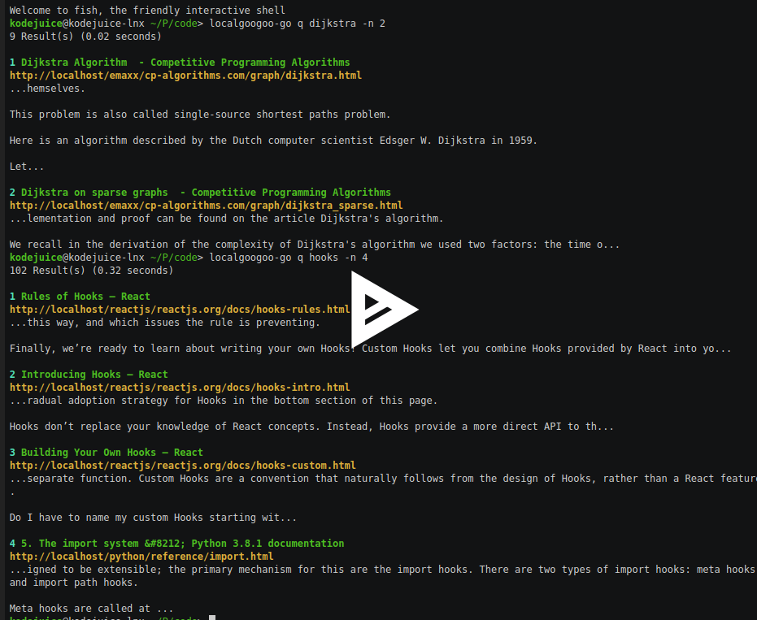
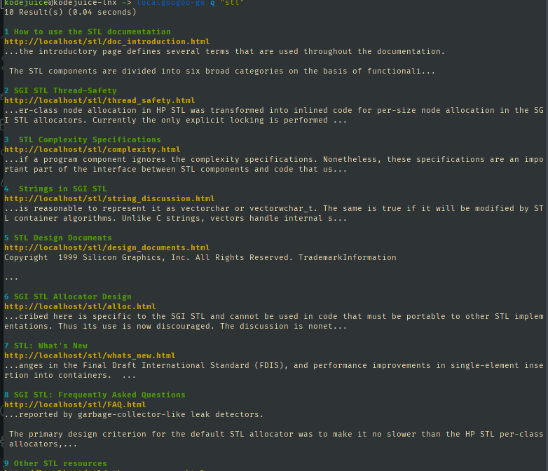

<h1 align="center"></h1>

<p align="center">
<a href="https://github.com/kodejuice/localgoogoo-go/releases/latest"></a>
<a href="https://github.com/kodejuice/localgoogoo-go/blob/master/LICENSE"></a>
<a href="https://github.com/kodejuice/localgoogoo-go/actions"></a>
<a href="https://goreportcard.com/report/github.com/kodejuice/localgoogoo-go"></a>

</p>

<p align="center">
<a href="https://asciinema.org/a/395042">

</a>
</p>

A command line tool that lets you use localGoogoo from the terminal.

Don't know what localGoogoo is?, you should <a href="https://github.com/kodejuice/localgoogoo"> check it out </a>

## Installation

### Requirements
  * Golang
  * <a href="https://github.com/kodejuice/localgoogoo">localGoogoo</a> installed on your system
<br><br>

#### Install using `go get`

```bash
$ go get http://github.com/kodejuice/localgoogoo-go
```

#### Install using `git clone`

```bash
$ git clone http://github.com/kodejuice/localgoogoo-go.git
$ cd localgoogoo-go
$ go install
```

This installs `localgoogoo-go` to your local machine, you can alias it to a shorter name, such as `localgoogoo` or `googoo`

Usage
-------------

Make sure localGoogoo is functioning properly in the browser, because all this package does is make http requests to localgoogoo installed on your system and render the results of any query on your terminal (This may change in the future).

```
Usage:
  localgoogoo-go [command]

Available Commands:
  crawl       Crawl specified wesite
  help        Help about any command
  q           Search the localgoogoo database

Flags:
      --config string   config file (default is $HOME/.localgoogoo.yaml)
  -h, --help            help for localgoogoo-go

Use "localgoogoo-go [command] --help" for more information about a command.
```

#### Example

```bash
$ localgoogoo-go q "stl"
```



> Note: The above output is due to the fact that i have an offline website (crawled) with information regarding `stl`, you may get a different output.

##### `q` flags

```
Usage:
  localgoogoo-go q <query> [flags]

Flags:
  -n, --count int   number of results to display (default 10)
  -h, --help        help for q
  -r, --reverse     display results in reversed order

Global Flags:
      --config string   config file (default is $HOME/.localgoogoo.yaml)
```
